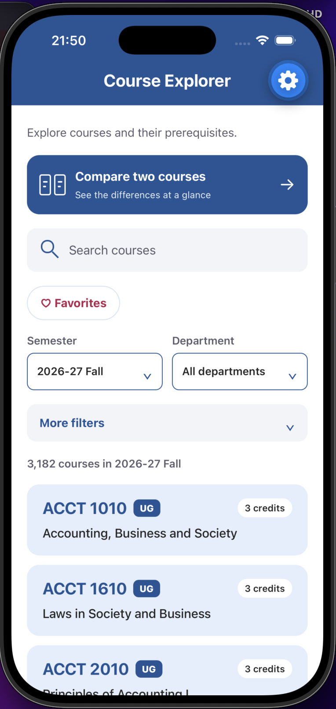
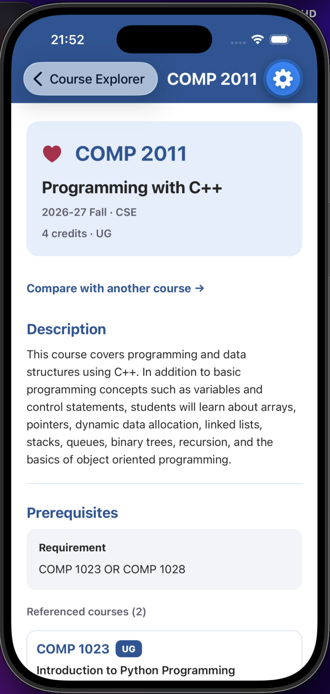
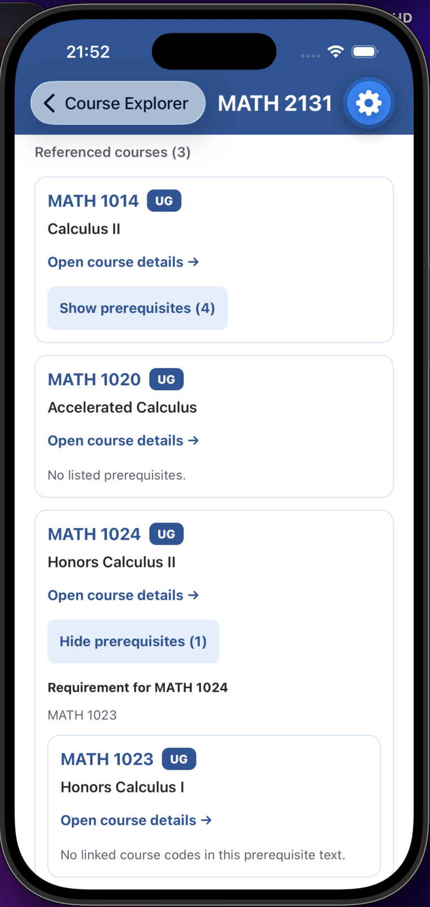
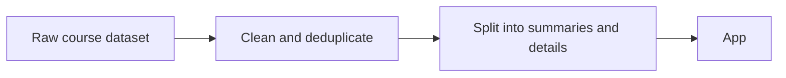

# HKUST Course Explorer

An offline React Native / Expo app for the [USThing App Team 2026-27 Fall technical test](https://simplistic-plough-ea3.notion.site/App-Team-2026-27-Fall-Technical-Test-Guideline-3dfcd8c4d00080d48650c130cc5f328d). Browse Clear Water Bay courses by semester and department, search by code or title, read course details, and explore prerequisites recursively.

<p align="center">
  
  
  
</p>

## Run

Requires Node.js 22.13+ or 24.x and npm. No backend, API key, or Python is needed; the processed catalogue is committed.

```bash
git clone https://github.com/Pannatad/usthing-course-explorer.git
cd usthing-course-explorer
npm ci
npm run web       # open in a browser
npm run ios       # iOS Simulator (requires Xcode)
npm run android   # Android emulator or device
```

`npx expo start` also works with Expo Go on a phone. Stack: Expo SDK 57, React Native 0.86, Expo Router.

## Test

```bash
npm test              # 27 data tests (Vitest), then 20 screen tests (Jest)
npm run typecheck     # TypeScript
npm run lint          # Expo ESLint config
npm run check:data    # rebuild the catalogue in a temp folder and confirm committed files match
```

`npm run test:data` and `npm run test:ui` run each suite on its own.

## Platforms tested

| Platform | What was checked |
| --- | --- |
| Web (Chromium) | All features and back navigation |
| iOS Simulator (iPhone 17 Pro, iOS 26.4, Expo Go) | Browsing, search, semester/department filters, details, prerequisite explorer, back navigation, keyboard taps |

## Features

- **Catalogue:** browse all courses in a semester, with credits and an undergraduate/postgraduate badge.
- **Semester and department filters:** switch semester or narrow to one department.
- **Search:** by course code or title; spaces and case are ignored (`comp2011` finds `COMP 2011`).
- **More filters:** subject, course number above a value, and credits (exactly, more than, or less than).
- **Course details:** description, credits, level, prerequisites, corequisites, and exclusions.
- **Prerequisite explorer:** expand prerequisites level by level, open any of them, with safe handling of cycles.
- **Favorites:** save a course with the heart on its detail screen, then show favorites only; kept after restarting the app.
- **Compare two courses:** credits, level, and requirements side by side.
- **Offline:** all data ships with the app; no network is needed.

## Architecture and state management

```
src/app/                  Expo Router routes (thin entry points)
  index.tsx               catalogue
  course/[termCode]/[courseCode].tsx   course details
  compare.tsx             two-course comparison
src/features/
  catalog/                CatalogScreen, CatalogHeader, CatalogFilters, useCatalogFilters
  comparison/             CourseComparison (coordinator), CourseChooser, ComparisonDetails
  favorites/              FavoritesProvider (context + AsyncStorage)
src/components/           reusable controls: course row, search, picker, filters, prerequisite tree
src/data/                 course types, repository (indexes, search, lookup), prerequisite resolution
src/data/generated/       processed catalogue (do not edit by hand)
scripts/                  data import and preparation
tests/                    data tests (Vitest) and screen tests (Jest + Testing Library)
```

- **No state library.** Screen state is React state; favorites use one React context.
- **Catalogue:** `useCatalogFilters` owns all filter values and rules (for example, changing semester keeps the department only if the new semester offers it). The components only display values and report changes. Filter state survives opening a course and returning, because the stack keeps the catalogue mounted.
- **Comparison:** `CourseComparison` owns the semester and the two selected courses; `ComparisonDetails` owns only which sections are expanded.
- **Data access:** one repository object (`src/data/repository.ts`) loads semester data lazily and exposes search and lookup. It is created from injected loaders, so tests use a small fixture catalogue.
- **Routes** use `termCode + courseCode` (for example `/course/2610/COMP2011`). Unknown routes show "Course not found"; corrupt generated data shows a separate error screen.

## Data processing

The dataset comes from the public [UST Archive catalogue](https://huggingface.co/datasets/ust-archive/catalog) and is included in `data/source/`. It is processed once at build time, and the app reads only the generated files.



- **Import:** keep only Clear Water Bay courses in four semesters (2026-27 Fall, and 2025-26 Summer, Spring, Winter).
- **Clean:** keep the newest version of each course, drop inactive courses, and stop the build on invalid or conflicting records.
- **Split:** summaries hold what the list needs (code, title, department, credits, level). Long text (description, requirements) moves to detail chunks.
- **Deduplicate:** identical detail text is stored once: 3,375 payloads for 12,476 course–semester records.
- **Result:** 46.1% less runtime JSON (8.9 MB to 4.8 MB).

Run `npm run prepare:data` to regenerate. `npm run check:data` confirms the committed files match.

## Search and filtering

- A semester's summaries are indexed on first use: a code-to-course map, per-department lists, and normalized search strings (uppercase, spaces removed).
- Search is a substring match on normalized code and title. Exact lookup is a map access.
- All filters intersect: semester, department, text, subject, course number (strictly greater than), and credits. Variable-credit courses match "exactly N" when N is inside their range.
- An invalid course number shows a hint and no results rather than being ignored.
- Changing semester or department clears a department or subject that no longer applies.
- Browsing and searching read summaries only; full details load when a course is opened or expanded. The list uses `FlatList` with memoized results.

## Prerequisite traversal

1. **Start from the course list (build time).** While preparing the JSON catalogue, a small scanner reads each course's prerequisite text and saves the course codes it mentions as a list, for example `"COMP 1023 OR COMP 1028"` becomes `["COMP 1023", "COMP 1028"]`. The original wording is kept and always shown.
2. **Build the tree only when needed (runtime).** The details screen shows the direct prerequisites first. A deeper level is looked up and added only when the user taps "Show prerequisites", so the app never builds the whole tree in advance.
3. **Recursive component.** `PrerequisiteNode` (`src/components/PrerequisiteExplorer.tsx`) shows one course and, when expanded, renders a `PrerequisiteNode` for each course it requires. Each node receives the path of courses above it. If a course is already on that path, the branch stops with "Already visited on this path", so cycles cannot recurse forever. Courses not in the catalogue show as unavailable, and every node links to its own detail screen.

## Assumptions and limitations

- Scope is the Clear Water Bay campus and four semesters.
- Not yet tested on Android or on standalone (non-Expo Go) builds.
- All catalogue chunks ship in the app bundle; chunking limits what is parsed, not what is installed.
- Native startup, memory, and scrolling performance have not been measured on a device.
- Favorites are saved per device and are not synced. Comparison selections are not saved after leaving the screen.
- Known issue: if device storage fails to load favorites, the app shows an error but still allows changes, which could overwrite previously saved favorites.
